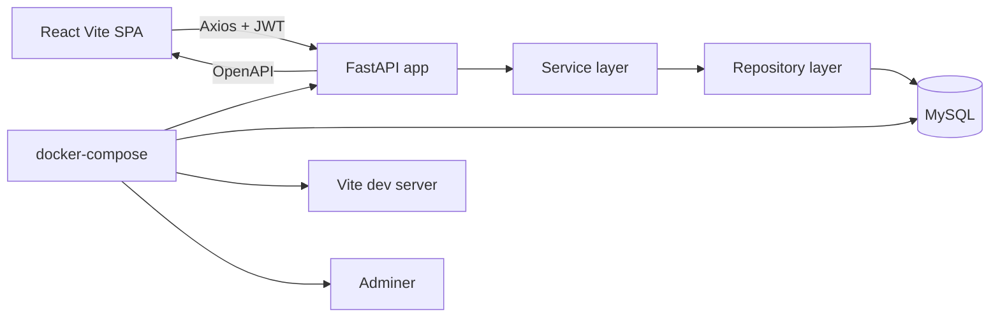

# Technologia — Architecture

A modern, layered Python + React starter inspired by the legacy QuotePlan
CodeIgniter ERP (`../quoteplan`). The goal is to give you a clean, idiomatic
foundation that future modules can be ported into without re-litigating
project-wide conventions.

## High-level



## Backend layout (`backend/app/`)

| Layer            | Folder                | Responsibility                                                 |
| ---------------- | --------------------- | -------------------------------------------------------------- |
| Configuration    | `core/config.py`      | Typed env via `pydantic-settings`                              |
| Security         | `core/security.py`    | Bcrypt password hashing + JWT access/refresh tokens            |
| Dependencies     | `core/deps.py`        | DB session, current user, optional `X-Tenant-ID` header        |
| Logging          | `core/logging.py`     | Loguru sink intercepting `uvicorn`/`fastapi` loggers           |
| ORM models       | `db/models/`          | SQLAlchemy 2 declarative models with `UUIDPKMixin` + timestamps |
| Pydantic schemas | `schemas/`            | Inbound DTOs and outbound response models                      |
| Repositories     | `repositories/`       | Thin async data-access layer per aggregate                      |
| Services         | `services/`           | Business rules; commit boundary; raises `HTTPException`         |
| API              | `api/v1/routes/`      | FastAPI routers per module, mounted in `api/v1/router.py`       |

A request flows: **route → service → repository → ORM model → DB**.
The route file is the only place that touches FastAPI primitives, the service
file is the only place that calls `commit()`, and the repository is the only
place that touches `select()`/`insert()`.

## Frontend layout (`frontend/src/`)

```
app/        Providers, router, AppShell layout
components/ shadcn-style design system primitives
features/   One folder per domain feature (auth, dashboard, projects, items)
lib/        api client (axios + JWT refresh), queryClient, utils
stores/     Zustand stores (auth, theme)
styles/     Global Tailwind CSS
```

Every feature folder owns its types, queries, components and pages — so a new
module is `mkdir features/po && copy projects/`.

## Auth

- Login: `POST /api/v1/auth/login` (OAuth2 password form) or `/login/json`.
- Returns access (60 min) + refresh (14 d) JWTs signed with `SECRET_KEY`.
- Frontend stores them in Zustand + `localStorage`. Axios interceptor
  transparently refreshes a 401 once via `/auth/refresh`.
- Bcrypt password hashing mirrors the existing convention in
  [quoteplan/application/models/Login_model.php](../../quoteplan/application/models/Login_model.php).

## Multi-tenant hook

The legacy QuotePlan codebase uses an `instance_name` per customer
(see [quoteplan/application/models/Login_model.php](../../quoteplan/application/models/Login_model.php)).
We don't activate multi-tenancy by default, but every table includes a
nullable `tenant_id` column and `core/deps.py` exposes a `TenantId`
dependency that reads `X-Tenant-ID` so it can be turned on later by:

1. Filtering every repository query by `tenant_id`.
2. Stamping `tenant_id` on `create()` calls.
3. Making the header required for non-admin roles.

## Porting a module from QuotePlan

1. Identify the controller (e.g. `quoteplan/application/controllers/Po.php`)
   and its model (`Po_model.php`).
2. Create files:
   - `backend/app/db/models/po.py`
   - `backend/app/schemas/po.py`
   - `backend/app/repositories/po_repository.py`
   - `backend/app/services/po_service.py`
   - `backend/app/api/v1/routes/po.py`
   - alembic revision under `backend/alembic/versions/`
3. Mount the router in `backend/app/api/v1/router.py`.
4. On the frontend, create `frontend/src/features/po/` with `types.ts`,
   `queries.ts`, `PoPage.tsx`, `PoFormDialog.tsx`. Add a route to
   `src/app/router.tsx` and a nav item in `AppShell.tsx`.

## What is intentionally **not** included

- Integrations (QuickBooks, Sage, Salesforce, Zoho, Deltek). Placeholder lives
  at `backend/app/integrations/`.
- SOAP services, SpreadJS, Chatbot — left out of the scaffold.
- Production deployment manifests — only a dev `docker-compose.yml` is provided.
